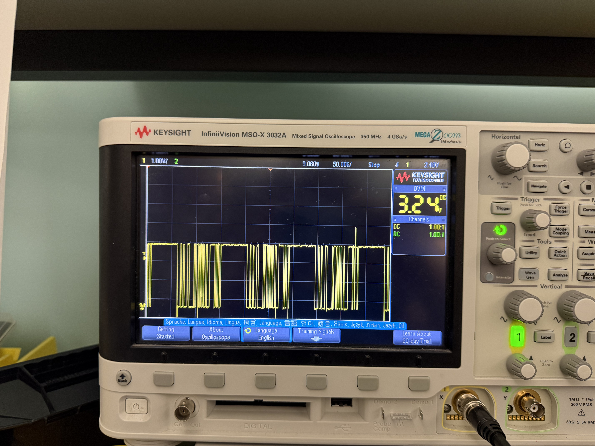
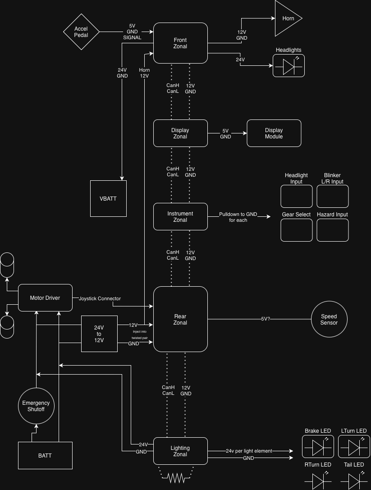

# Building a Go-kart from an electric wheelchair

## Origin

The electric go-kart didn't start its life as a go-kart, but rather an electric wheelchair. To be specific, the [Jazzy Select][wheelchair] from Pride Mobility. Our robotics group received this wheelchair purely by chance, whenever we received an email from somebody in the community asking if we wanted it. Because of our tendency to collect absolute junk, we obviously took it immediately. Shortly after, we had our own electric wheelchair we could call our own. 

From this point, we wanted to get it running just to find out what it was capable of, or if it even drives at all. We found some leftover 12V lithium batteries, and with 6 batteries, we had the 24V the wheelchair was looking for. With a push of the power button-VOILA-we had life. We see a flashing light and beeping sounds, and we immediately hop into the seat and take it for a spin.

The first thing we notice is the surprising amount of speed and power behind the chair. We had so much fun toying around and pushing the limits of the chair, until we had our first "incident." Our dear friend [Jason][jason] was speeding through the building, until he wasn't. We hear him start laughing, yelling for us to come over. We make our way over when we realize that he had punched a hole in the sheetrock with the wheelchair. We do our best to clean up the mess, and move on, hoping University officials don't notice. 

Our last test was the weight test, to see how much torque this chair can really deliver. We loaded 4 grown men onto the wheelchair and pushed forward, and it still moved. We estimate that the chair was easily moving around 700 lbs, if you include the weight of the chair. This gave us a basis for how much we could reduce the torque and still have the chair able to move.

## Trying to understand the joystick

Of course, going into this project, we knew we didn't want to control the car with the original joystick. Step one for us was tearing everything down and trying to understand how the joystick, and overall electrical system, worked on this wheelchair. This ended up being the hardest part about the project, but was definitely the most rewarding part. We began by scoping the control module with 24V provided to the stick, and we saw... NOTHING! The control board would show signs of life, but we would see absolutely no signals on the data line except a small burst of data right when we turned it on. We then tried scoping the data line with the motor driver hooked up. We turned on the joystick with everything properly hooked up, and we saw data! 

Well, now that we have this data, what can we do with it? Our initial plan was to try and record the data for each type of "packet" we would need to send. We also spent some time trying to reverse engineer the packet structure, to see if we could just build our own packets. Around this point, we realized that each "packet" had a response from the driver... Okay, shouldn't be a problem, until we realized that our voltage levels seemed to be changing with every call and response. After asking around from some of my friends, we realized that the wheelchair may be using UART over half-duplex RS232. While we were considering exploring this pathway, we decided to pivot and explore a different option... tearing deeper into the wheelchair.

The backup plan we came up with was to try and replicate the analog signals of the actual joystick module itself, rather than the entire control board. This meant a lot of probing and reverse engineering of the original joystick module. Luckily, we did find a [datasheet][joystick-datasheet] that describes the outputs of the stick itself.

Great, now we have an idea of how to actually replicate the joystick, but how do we physically produce the voltages? To solve this, we used two 4-channel [DACs][dac] to output all the analog signals we needed. Connected to an Arduino Uno via I²C, we are able to create our analog signals. After much trial and error, we are able to control the motors with the Arduino, bringing us one step closer to driving our go-kart.

## Tinkering with CAN

While all the developments regarding the joystick were happening, on the side, I was working on getting a [CAN][can-bus] bus working. From the beginning of the project, I knew I wanted to use CAN for the primary communication protocol across the car, primarily as a learning exercise. Going into the automotive industry, this seemed like the perfect project to help myself get more acquainted with the technologies I would be using every day. 

The initial exploration of this used two ESP-32's. The goal was to use the embedded [TWAI][twai] controller on board to drive the CAN bus, paired with a [TJA1050][tja1050] CAN transceiver. After many days of playing with it, switching ESP-IDF versions, trying different packages, and rebuilding the hardware multiple times, hope was lost on using the ESP32 to drive the CAN bus. After a trip to Microcenter, I picked up the Inland CAN bus shield, which when paired with the example code, worked immediately!

At this point, I had everything I needed electronically to build out the rest of the car.

## Accessories for the go-kart

With a solid infrastructure built up, we now had the opportunity to tack on as many accessories as possible. This includes:
- Pair of car horns
- Front light bar
- Driver display
- Brake lights
- Turn signal
- Accelerator pedal
- Speed sensor
- Input controls

With all of these accessories, we decided to load the car full of Arduinos to manage everything. We have a total of 5 microcontrollers handling everything on the vehicle, each one controlling everything in the area on the vehicle. For our situation, this gives us the front zone, rear zone, instrument cluster zone, display zone, and the rear-lighting zone. While some of these could have been consolidated, we separated them for space concerns to make room for other miscellaneous electronics, like relays. 

From this point, it was necessary to start the long-term planning of the electrical hardware and how things would be laid out on the final car, so the following electrical diagram was created.

## References
[wheelchair]: https://www.pridemobility.com/jazzy-power-chairs/jazzy-select/  
[jason]: https://jasonaa.me  
[joystick-datasheet]: https://teslaandi.wordpress.com/wp-content/uploads/2013/10/d50800-031-joystick-potentiometer-info.pdf  
[dac]: https://www.amazon.com/dp/B0DF7NTTTQ  
[can-bus]: https://en.wikipedia.org/wiki/CAN_bus  
[twai]: https://docs.espressif.com/projects/esp-idf/en/stable/esp32/api-reference/peripherals/twai.html  
[tja1050]: https://www.amazon.com/dp/B0C7ZBDG4B